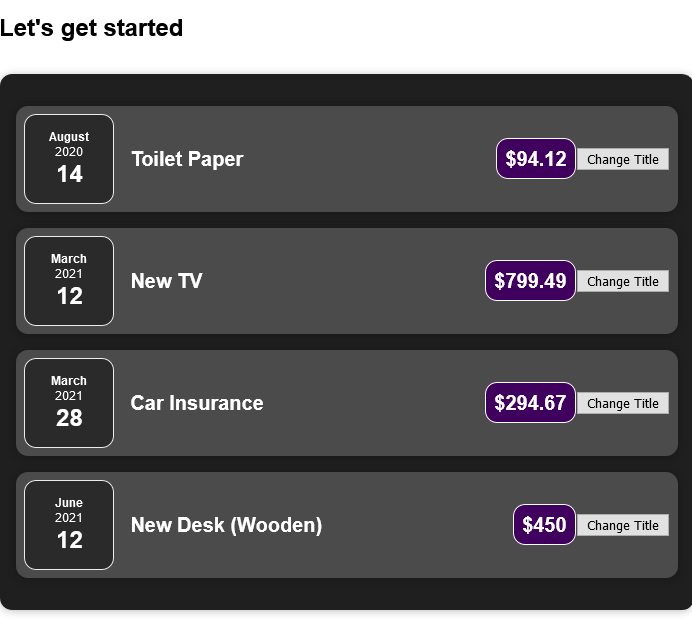

## Day 1 & 2

- Was able to understand what react is and how react works.
- Well, React is simply HTML,CSS and JS put together in components.
- Was able to understand how props work and how it could be used to pass data from one component to another.
- was able to understand the basics of JSX.

## Day 3 & Day 4

- was able to understand how the special children props is used to wrap components with custom wrappers. The value of the special children prop would be the content of the opening and closing tag of your custom component.
- Composition is a manner in which we combine components together to form the overall UI. Here we use simple Html elements to form a custom html element which is basically used by another component to form the overall UI.
- Each component can only return one root element , which wraps all the other children elements.
- The concept of USESATE - This concept allows us to define values as state where changes to these values ultimately gets reflected in the component function being called again. It is a react hook and can be called only inside a component. in simple words , useState hooks allows to change the state of a component. In react , one component is called once . only if the state of the react component is changed through the useState hook , the component is reevaluated and the state would be changed.

